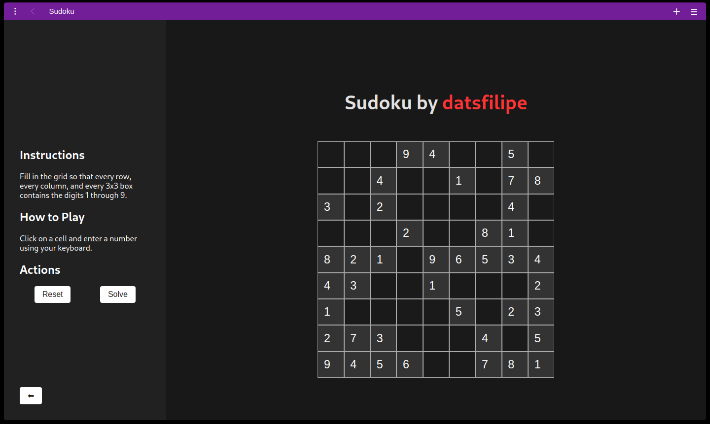

# Sudoku

 
 

 

> A simple sudoku game made with ReactJS.

## How to Run the Project

1. Clone this repository.
2. Run `pnpm install` command.
3. Run `pnpm dev` command.

## How to Contribute

Follow these steps to contribute to the project:

1. Fork the repository.
2. Create a new branch: `git checkout -b feature-branch-name`.
3. Make your changes and commit them: `git commit -m 'Add some feature'`.
4. Push to the branch: `git push origin feature-branch-name`.
5. Open a pull request.

Please ensure that your code adheres to the project's coding standards.

## Contributors

<table>
    <tr>
        <td align="center">
            <a href="https://github.com/datsfilipe">
                 
                
                    <b>Filipe Lima</b>
                
            </a>
        </td>
    </tr>
</table>

## License

This project is licensed under the [License](LICENSE).
